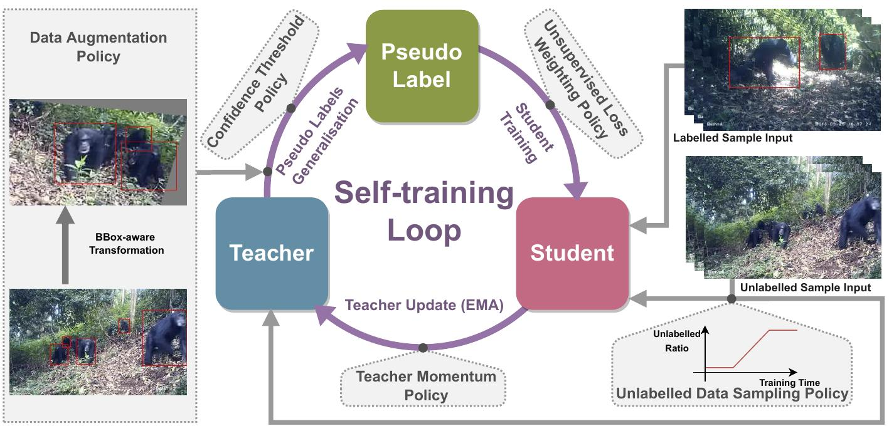
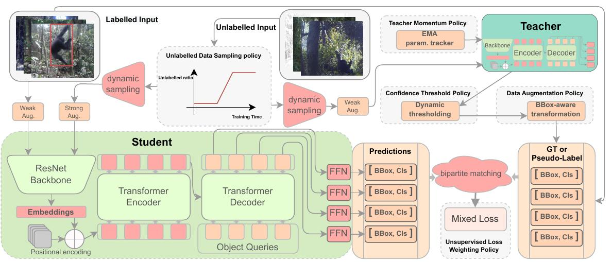
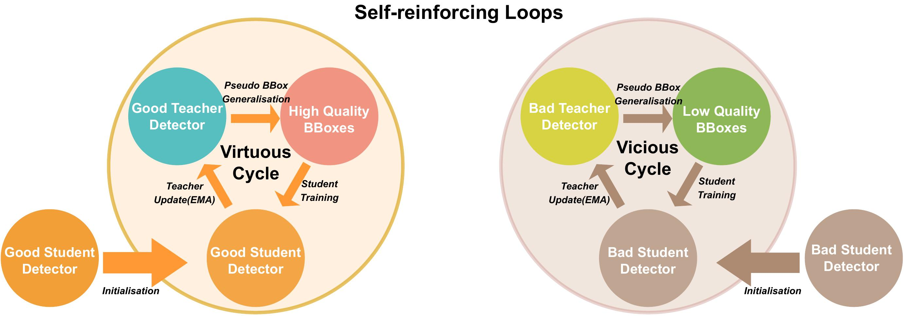

<link rel="shortcut icon" type="image/x-icon" href="favicon.ico">
<p align="center" style="font-size:30px">
<a href="https://youshye.xyz/">Xinyu Yang</a> , <a href="http://people.cs.bris.ac.uk/~burghard/">Tilo Burghardt</a> and  <a href="http://people.cs.bris.ac.uk/~majid//">Majid Mirmehdi</a>
</p>


<!--  -->
<!--  -->

## Abstract

We propose a novel end-to-end curriculum learning approach that leverages large volumes of unlabelled great ape camera trap footage to improve supervised species detector construction in challenging real-world jungle environments. In contrast to previous semi-supervised methods, our approach gradually improves detection quality by steering training towards virtuous self-reinforcement. To achieve this, we propose integrating pseudo-labelling with dynamic curriculum learning policies. We show that such dynamics and controls can avoid learning collapse and gradually tie detector adjustments to higher model quality. We provide theoretical arguments and ablations, and confirm significant performance improvements against various state of-the-art systems when evaluating on the Extended PanAfrican Dataset holding several thousand camera trap videos of great apes. We note that system performance is strongest for smaller labelled ratios, which are common in ecological applications. Our approach, although designed with wildlife data in mind, also shows competitive benchmarks for generic object detection in the MS-COCO dataset, indicating wider applicability of introduced concepts.


## Self-reinforced training loops




## Comparison with SOTA


## Paper


[PDF](https://youshyee.xyz/pdfs/DCL.pdf)
[Poster](./conference_poster.pdf)
[ArXiv](https://arxiv.org/abs/2205.00275)


## PanAfrican2019 Dataset


The annotations for the three datasets can be found [here](https://data.bris.ac.uk/data/dataset/1v9op9lc6zi5g25kkwa5smb3vq).

The Dataset PanAfrican2019 Video can be found [here](mpi2019.txt).

## Bibtex

```markdown
@misc{yang2021dcldet,
      title={Dynamic Curriculum Learning for Great Ape Detection in the Wild},
      author={Xinyu Yang and Tilo Burghardt and Majid Mirmehdi},
      year={2022},
      eprint={2205.00275},
      archivePrefix={arXiv},
      primaryClass={cs.CV}
}
```

## Acknowledgements

We would like to thank the entire team of the Pan
African Programme: ‘The Cultured Chimpanzee’ MaxPlanck-Institute (2022) and its collaborators for allowing the use of their data for this project. Please contact the copyright holder Pan African Programme at
http://panafrican.eva.mpg.de to obtain the source
videos from the dataset. Particularly, we thank: H
Kuehl, C Boesch, M Arandjelovic, and P Dieguez. We
would also like to thank: K Zuberbuehler, K Corogenes,
E Normand, V Vergnes, A Meier, J Lapuente, D Dowd,
S Jones, V Leinert, EWessling, H Eshuis, K Langergraber, S Angedakin, S Marrocoli, K Dierks, T C Hicks,
J Hart, K Lee, and M Murai. Thanks also to the team
at https://www.chimpandsee.org. The work that allowed for the collection of the dataset was funded by
the Max Planck Society, Max Planck Society Innovation
Fund, and Heinz L. Krekeler. In this respect we would
also like to thank: Foundation Ministre de la Recherche
Scientifique, and Ministre des Eaux et For lts in Cote
d’Ivoire; Institut Congolais pour la Conservation de la
Nature and Ministre de la Recherch Scientifique in DR
Congo; Forestry Development Authority in Liberia; Direction des Eaux, For lts Chasses et de la Conservation
des Sols, Senegal; and Uganda National Council for Science and Technology, Uganda Wildlife Authority, National Forestry Authority in Uganda.
